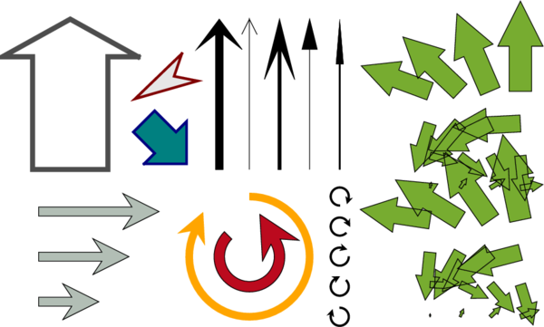

# Generalized 2-D arrows plot

## arrows.m

This little function could be an alternative to other existing arrow plot functions, since it has very simple, vectorized and effective coding. In fact, arrows are all plotted in a single patch command! The function also accepts any standard patch parameter/value pair like 'FaceColor', 'EdgeColor', 'LineWidth', etc.

It can be used to plot a personalized arrow at coordinates X,Y with length L and azimuth AZ, or any of these arguments can be vector or matrix, like QUIVER function, to plot multiple arrows.

Arrow's aspect ratio, head and segment line shapes are configurable with 4 parameters: head width, head length, head inside length and segment line width, all normalized to arrow's length. 

## Examples
```matlab
arrows(0,0,1,45,'FaceColor','none','LineWidth',3)
```

```matlab
arrows(1,0,1,0,[.2,.4,.2,.02])
```

```matlab
[xx,yy] = meshgrid(1:10);
arrows(xx,yy,rand(size(xx)),360*rand(size(xx)))
```



## Author
**François Beauducel**, [IPGP](www.ipgp.fr), [beaudu](https://github.com/beaudu), beauducel@ipgp.fr 

## Documentation
Type 'doc arrows' for help and syntax.

