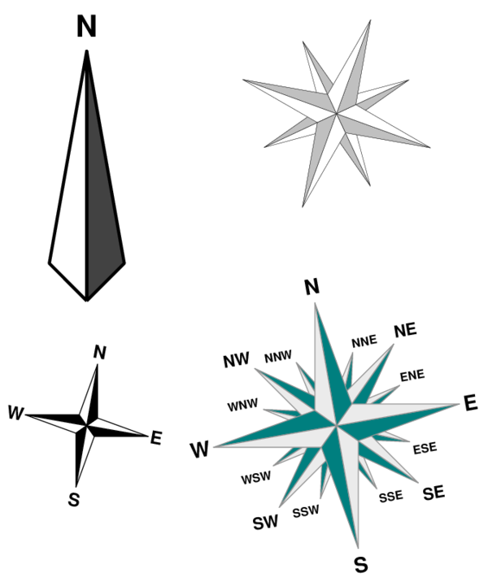

# Compass rose plot

## comprose.m

This little function draws a compass rose with optional Cardinal directions with basic properties:
- 1, 4, 8, or 16-points
- position X,Y on current axis
- size (in axis unit)
- azimuth (in degrees)
- accepts any additional patch param/value pairs, like 'FaceColor', 'EdgeColor', 'LineWidth', ...
- displays Cardinal point names (optional)

## Examples
```matlab
comprose(0,0,8,.5,10)
```

```matlab
comprose(2,-1,1,2,0,20,'LineWidth',2,'FaceColor',.5*[1,1,1])
```

```matlab
h = comprose(1,2.5,16,1,-10);
set(h(:,1),'FaceColor',[0,.5,.5],'EdgeColor',.5*[1,1,1])
set(h(:,2),'FaceColor',.9*[1,1,1])
```



## Author
**François Beauducel**, [IPGP](www.ipgp.fr), [beaudu](https://github.com/beaudu), beauducel@ipgp.fr 

## Documentation
Type 'doc comprose' for help and syntax.

