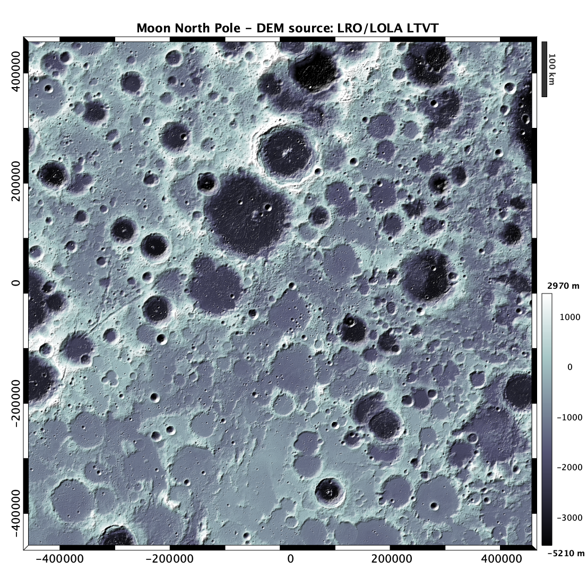
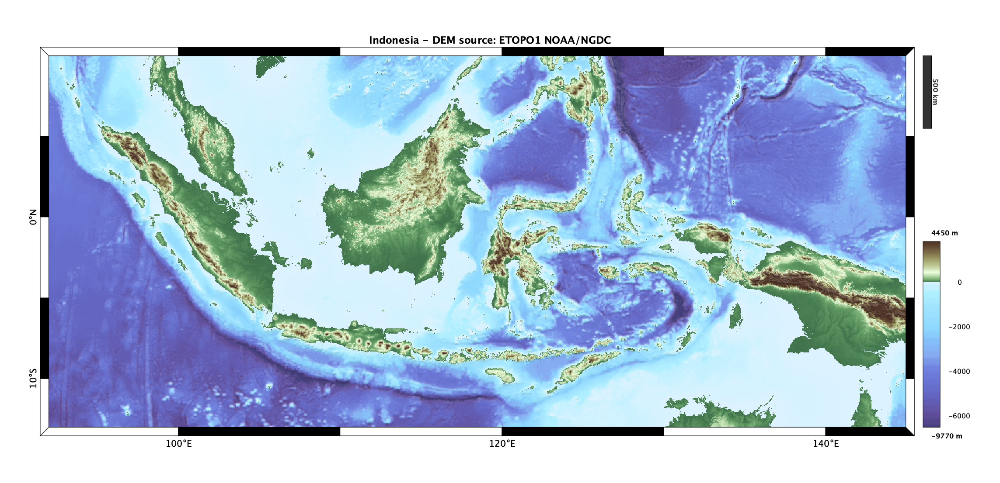
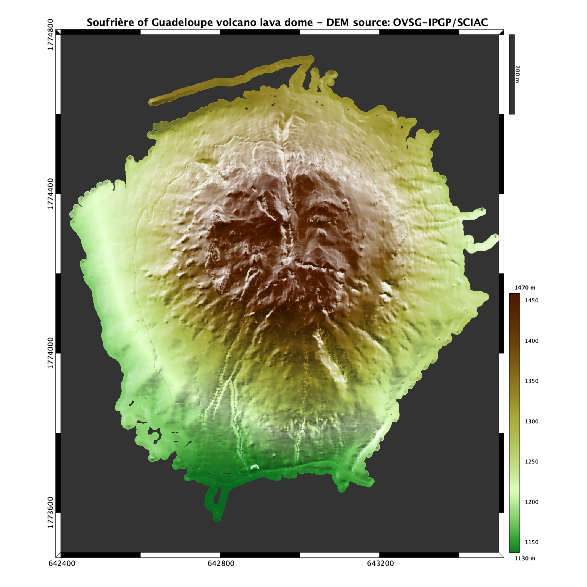

# Shaded relief image plot (digital elevation model)

This function plots regular grids of elevation X,Y,Z in a more efficient manner than SURFL Matlab's function, because it recomputes lighting and displays result as shaded color flat RGB image. It uses also median-style filter to deal with min/max values of elevations and gradient, and proposes two specific colormaps "landcolor" and "seacolor".

Color mapping and lighting parameters can be changed from default values. In addition, several options are available: 'cartesian' to add decimal axis, 'latlon' to add geographical axis (GMT-like), 'legend' for an automatic scaling legend, 'lake' for automatic flat area color-filling and 'interp' to fill the novalue gaps...

This may be useful to produce high-quality and moderate-size Postscript image adapted for publication.

Figure examples:

Moon North Pole using the bone colormap and high contrast lighting (DEM source: raster LRO/LOLA LTVT)

Indonesia archipelago using default colormaps, 'dms' axis basemap and legend scales (DEM source: raster NOAA/NGDC ETOPO1)

Soufrière of Guadeloupe volcano lava dome: 1-m resolution with NaN values (DEM source: OVSG-IPGP/SCIAC)

See "doc dem" for syntax, examples and help. See also the READHGT function from same author.
