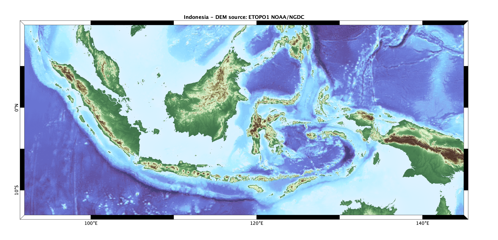

# Shaded relief image plot (digital elevation model)

## dem.m
This function plots regular grids of elevation X,Y,Z in a more efficient manner than SURFL Matlab's function, because it recomputes lighting and displays result as shaded color flat RGB image. It uses also median-style filter to deal with min/max values of elevations and gradient, and proposes two specific colormaps "landcolor" and "seacolor".

Color mapping and lighting parameters can be changed from default values. In addition, several options are available: `'cartesian'` to add decimal axis, `'latlon'` to add geographical axis (GMT-like), `'legend'` for an automatic scaling legend, `'lake'` for automatic flat area color-filling and `'interp'` to fill the novalue gaps...

This may be useful to produce high-quality and moderate-size Postscript image adapted for publication.

## Examples

Moon North Pole using the bone colormap (`'colormap','bone'`), single light source northwest (`'azimuth',-45`) and high contrast lighting using 0.2% median filter (`'lcut',.2`). DEM source: raster LRO/LOLA LTVT.

Indonesia archipelago using default land/sea colormaps, lower saturation value (`'saturation',0.5`) and lat/lon axis basemap (`'latlon'`). DEM source: raster NOAA/NGDC ETOPO1.

Soufrière of Guadeloupe volcano lava dome: 1-m resolution containing NaN values, two light sources (`'azimuth',[-45,45]` which is the default), cartesian basemap axes (`'cartesian'`) and legend scales (`'legend'`). DEM source: OVSG-IPGP/SCIAC 2001.

Comparison of the two available shading methods on the Guadeloupe archipelago and Piton de la Fournaise volcano using roma reversed colormap (`'landcolor',flipud(roma)`) and a single light source (`'azimuth',-45`): *(left)* uses the default light method (`'shading','light'`), *(right)* stack/transparency method (`'shading','stack'`) with default opacity value of 50% (`'opacity',.5`). DEM source: SRTM/NASA 2001.

## Author
**François Beauducel**, [IPGP](www.ipgp.fr), [beaudu](https://github.com/beaudu), beauducel@ipgp.fr

## Documentation
See "doc dem" for syntax, examples and help. See also the [READHGT](../readhgt/) function from same author.
