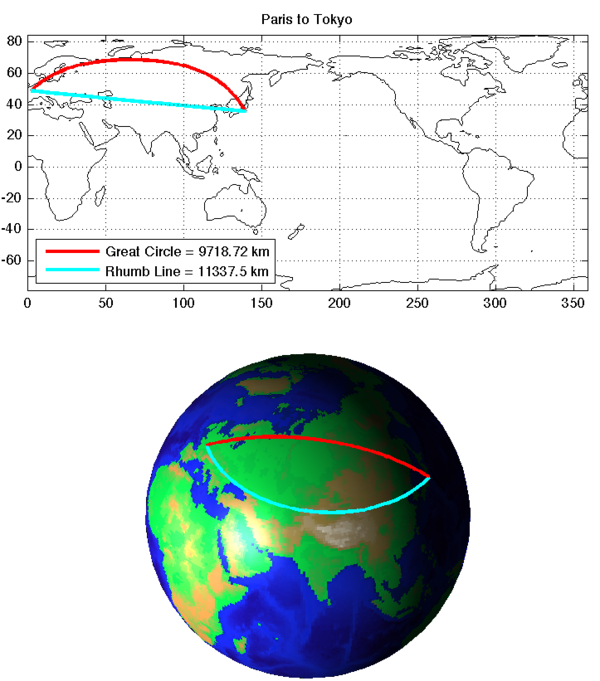

# mapping-matlab/greatcircle

## greatcircle.m
The function GREATCIRCLE computes the shortest path along the great circle ("as the crow flies") between two points defined by their geographic coordinates (latitude and longitude). With one output argument it returns distance or vector of distances, with two or more output arguments it returns path coordinates and optional vector of distances and bearing angles along the path.

## loxodrome.m
The function LOXODROME computes the path with a constant bearing, crossing all meridians of longitude at the same angle. It returns also a vector of distances and the bearing angle.

Loxodrome path (also known as "rhumb line") is longer than great circle one, but still used in navigation as it is easier to follow with a compass.

Type 'doc greatcircle' or 'doc loxodrome' for syntax, help and examples.
