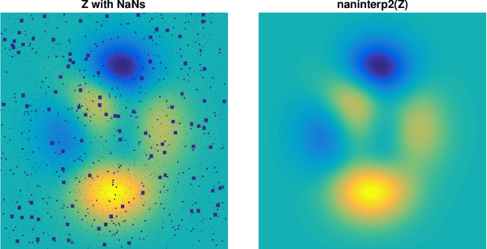

# 2-D optimized linear interpolation

## naninterp2.m

The GRIDDATA Matlab's core function may fail with memory issue on huge grids, depending on your computer capabilities. This simple function optimizes the linear interpolation, by reducing the amount of relevant data (only gap neighbours) before calling GRIDDATA. This results in a very fast computing, the speed will depend now on the amount of gaps and less on the amount of valid data (size of the grid).

## Example
```matlab
z = peaks(1000);
% simulates random gaps of different sizes
for n = [10,5,2]
  z(ceil(rand(1e4/n^2,1)*numel(z))) = NaN;
  z = conv2(z,ones(n)/n,'same');
end

subplot(211)
imagesc(z); % with gaps
subplot(212)
imagesc(naninterp2(z)) % gaps filled
```




## Author
**François Beauducel**, [IPGP](www.ipgp.fr), [beaudu](https://github.com/beaudu), beauducel@ipgp.fr 

## Documentation
Type 'doc naninterp2' for help and syntax.

