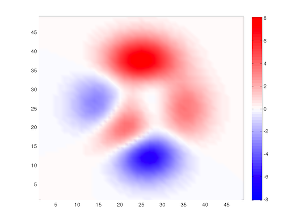

# Polarized color map

## polarmap.m

When representing "polarized" data for which zero and sign are meaningful (like for instance, a gravity anomalies map), it is useful to have a colormap where white stands for zero value, and greater magnitudes are plotted as colors with increasing saturation.

This little function POLARMAP has two different usages:
- proposes a new red-white-blue colormap that is standard for this purpose (same usage as other Matlab colormaps);
- applies a zero-center white shading to any existing colormap, like JET or HSV, or user defined. 

## Examples
```matlab
pcolor(peaks), shading interp
polarmap, colorbar
```

```matlab
polarmap(jet,0.5)
```



## Author
**François Beauducel**, [IPGP](www.ipgp.fr), [beaudu](https://github.com/beaudu), beauducel@ipgp.fr 

## Documentation
Type 'doc polarmap' for help and syntax.

