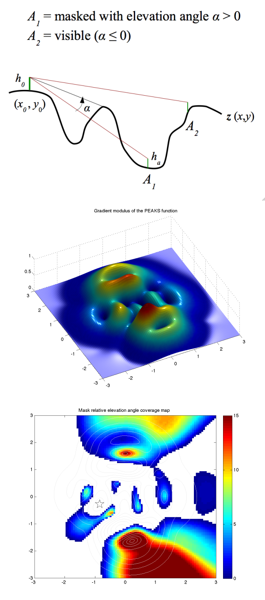

# Radio link coverage map

## radiocover.m

This program computes a map of visibility from a selected point on a topography. It has been written to help the search for radio relay best location. Because it considers only direct line of sight, it gives a good estimation for possible radio link for short distances only (less than 10 km), neglecting curvature of the Earth, Fresnel zone and atmospheric refraction on radio waves propagation. The program computes the relative elevation angle of the mask for each point (the angle is null or negative if the point is visible).

The function needs a digital elevation model Z and associated (X,Y) vectors or matrices of coordinates (same unit as Z), position of the point (X0,Y0), the antenna height H0 (for instance 4 m), and the hypothetic antenna height Ha on each topography points (for instance 3 m). When no output argument is given, the function plots a map of the results (color map of mask angles, and blank for visible points, see example screenshot).

The script is not fully optimized because it makes a global loop on the matrix elements to compute each profile of topography... (I didn't find (yet) a way to fully vectorize the problem), so it takes some time to compute, depending on the number of element of Z. However, I found a faster algorithm (about 2 times faster), giving approximate result but usefull to process a first map. See help for syntax, and script comments for details.

## Example
```matlab
[x,y,z]=peaks(100);
[fx,fy]=gradient(z);
z=sqrt(fx.^2+fy.^2);
surf(x,y,z), shading flat, light, view(-24,74)
radiocover(x,y,z,-0.84,-0.27,.05,.05)
```



## Author
**François Beauducel**, [IPGP](www.ipgp.fr), [beaudu](https://github.com/beaudu), beauducel@ipgp.fr 

## Documentation
Type 'doc radiocover' for help and syntax.

