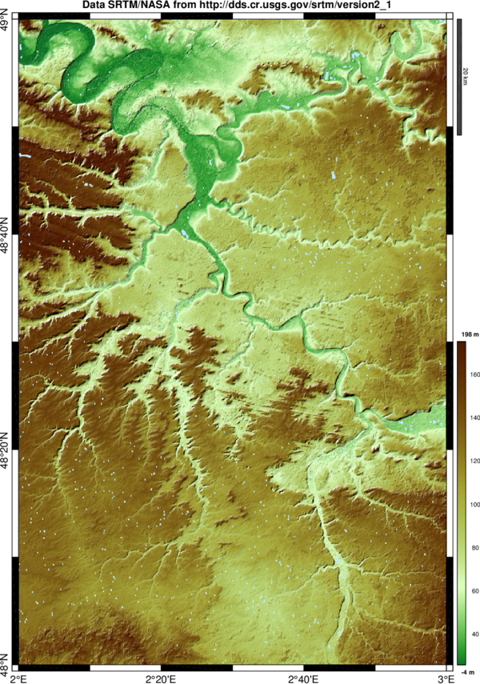
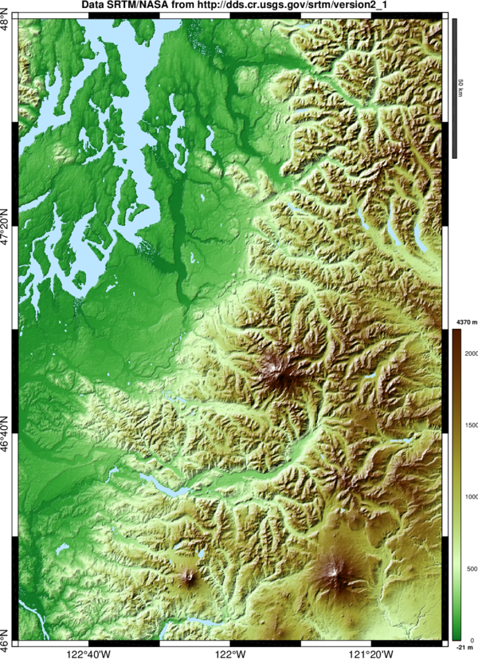
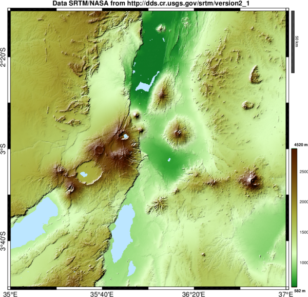

# Import/download NASA SRTM DEM data files (.HGT)

This function imports .HGT "height" binary data files from NASA SRTM global digital elevation model of Earth land, corresponding to 1x1 degree tiles of 3-arc seconds resolution (SRTM3, around 90 m) and 1-arc second (SRTM1, around 30 m) for USA territory, and returns coordinates vectors latitude and longitude, and a matrix of elevation values.

The function includes an automatic download of data from the USGS SRTM webserver, so indicating latitude and longitude is sufficient to get the data and instant map plot anywhere in the World. Also some basic options as 'merge' to concatenate tiles, 'interp' for gaps (novalue) linear interpolation, 'crop' for rectangle selection inside tile(s).

## Examples
- to plot a map of the Paris region, France (single tile):
```matlab
readhgt(48,2)
```


- to plot a map of Flores volcanic island, Indonesia (5 tiles):
```matlab
readhgt(-9,119:123,'merge')
```

- to download SRTM1 data of Cascade Range (27 individual tiles):
```matlab
X=readhgt(40:48,-123:-121);
```


![Misti volcano,  (SRTM1) obtained with readhgt([-16.4,-16.2,-71.5,-71.3])](readhgt_example_misti.png)



## Author
**François Beauducel**, [IPGP](www.ipgp.fr), [beaudu](https://github.com/beaudu), beauducel@ipgp.fr 

## Documentation
Type 'doc readhgt' for syntax, help and examples. The function needs the file "readhgt_srtm_index.txt" and get better mapping results with author's dem.m function.
